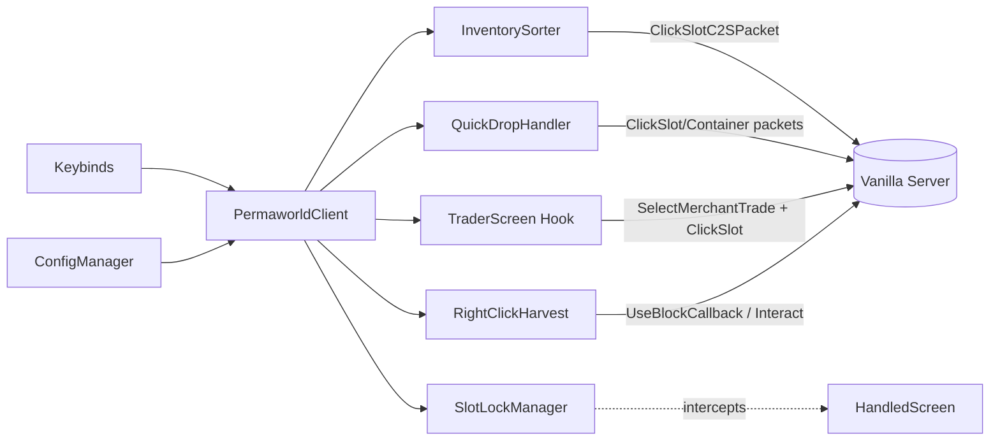

# Requirements

### Overview & Goals
Crear un mod de utilidades del lado cliente para un servidor Vanilla de Minecraft (Fabric, MC 26.1.2). El mod añade calidad de vida sin alterar el comportamiento del servidor: el servidor sigue siendo Vanilla puro y el mod solo necesita estar instalado en los clientes.

Objetivo: mejorar la productividad del jugador con atajos configurables y pequeños asistentes de UI, manteniendo compatibilidad estricta con un servidor Vanilla (todas las acciones se traducen a paquetes/clicks que un cliente Vanilla podría hacer).

### Scope
**In Scope**
- Ordenar inventario con shortcut configurable.
- Quick Drop Stack: enviar items del inventario a cofres cercanos que ya contienen ese item.
- Slot Lock estilo Terraria: marcar slots como bloqueados (no se mueven, no se ordenan, no se tiran).
- Trader Quick Buy: botones en la GUI del aldeano para ejecutar trades; posibilidad de "lockear" trades favoritos.
- Right-Click Harvest: cosechar cultivos maduros con click derecho y replantar automáticamente.
- Pantalla de configuración y keybinds (todo configurable).
- Persistencia local de configuración y de slots bloqueados / trades favoritos.

**Out of Scope**
- Cualquier cambio en el lado servidor (mod es client-only).
- Auto-farms automáticos, auto-clickers, o cualquier cosa que envíe input sin acción del jugador (anti-cheat friendly).
- Hacks como xray, fly, kill aura, etc.
- Soporte de versiones de MC distintas a 26.1.2.

### User Stories
- Como jugador, quiero pulsar una tecla para ordenar mi inventario y no perder tiempo arrastrando items.
- Como jugador, quiero pulsar una tecla mirando a un cofre (o cerca) para que todos los items del mismo tipo que ya están en cofres cercanos se muevan allí.
- Como jugador, quiero bloquear un slot (ej. mi pico de Fortuna) para no tirarlo ni moverlo por error al ordenar.
- Como jugador, quiero marcar trades favoritos de un aldeano y comprarlos en bloque con un solo botón.
- Como jugador, quiero hacer click derecho en un trigo maduro y que se coseche y replante automáticamente.

### Functional Requirements
- Todos los atajos deben ser configurables vía `KeyBinding` y pantalla de opciones.
- Las acciones se ejecutan emulando interacciones Vanilla (`ClickSlotC2SPacket`, `PlayerInteractBlockC2SPacket`, `SelectMerchantTradeC2SPacket`, etc.) para ser indistinguibles del cliente Vanilla en el servidor.
- Slot Lock se renderiza con un overlay sobre el slot bloqueado en cualquier `HandledScreen` que muestre el inventario del jugador.
- Quick Drop Stack solo considera cofres en un radio configurable (por defecto 8 bloques) y solo cofres ya abiertos previamente o detectables por raycast/área cercana.
- Right-Click Harvest solo funciona en cultivos maduros (`CropBlock` con edad máxima) y solo replanta si hay semilla del mismo tipo en el inventario.
- Trader Quick Buy ejecuta trades secuencialmente respetando stock y espacio en inventario; se detiene con feedback si falla.

### Non-Functional Requirements
- Compatibilidad: Minecraft 26.1.2, Fabric Loader 0.19.2, Fabric API 0.149.1, Java 25.
- Sin dependencias adicionales más allá de Fabric API.
- Configuración persistida en `config/permaworld.json`.
- Anti-cheat friendly: ritmo de paquetes con un pequeño delay configurable entre clicks sintéticos.

# Technical Design

### Current Implementation
Proyecto Fabric con `splitEnvironmentSourceSets` y varias milestones ya implementadas:
- `src/main/java/net/serex/permaworld/Permaworld.java` — `ModInitializer` común casi vacío; mantiene `MOD_ID` y logger.
- `src/client/java/net/serex/permaworld/client/PermaworldClient.java` — carga config, registra keybinds y módulos (`SortFeatureModule`, `SlotLockFeatureModule`, `RightClickHarvest`).
- `src/client/java/net/serex/permaworld/client/config/` — config JSON persistida en `config/permaworld.json`, con toggles para sort, quick drop, slot lock, trader y harvest.
- `src/client/java/net/serex/permaworld/client/keybind/` — keybinds registrados y polling GLFW para teclas que deben funcionar con pantallas abiertas.
- `src/client/java/net/serex/permaworld/client/feature/sort/` — sort contextual para inventario/storage o contenedor bajo el cursor, traducido a clicks Vanilla (`ContainerInput.PICKUP`). La estrategia ordena stacks existentes sin fusionarlos, porque el executor actual hace swaps.
- `src/client/java/net/serex/permaworld/client/feature/slotlock/` + `AbstractContainerScreenMixin` — favoritos/lock por item id, overlay de candado y cancelación de clicks sobre items bloqueados.
- `src/client/java/net/serex/permaworld/client/feature/harvest/` — right-click harvest para trigo, zanahoria, patata y remolacha maduros, con búsqueda de semilla/item compatible.
- Tests JUnit existentes para `SortStrategy`, `CropReplanter` y utilidades puras de keybind.

Pendiente: Quick Drop Stack, Trader Quick Buy, pantalla de configuración y validación manual completa in-game.

### Key Decisions
- **Client-only**: toda la lógica vive en `src/client`. `Permaworld#onInitialize` queda casi vacío (solo registra cosas comunes si hace falta, ej. codecs de config).
- **Sin protocolo custom**: nada de packets propios al servidor; todas las acciones se hacen con paquetes Vanilla para ser server-agnostic.
- **Config en JSON**: librería propia minimal con `Gson` (ya transitivo en MC) en `config/permaworld.json`. Sin dependencias extra como Cloth Config para mantenerlo ligero, pero estructurado de forma que se pueda añadir luego.
- **Mixins mínimos**: usar APIs públicas de Fabric (`ScreenEvents`, `UseBlockCallback`, `ClientTickEvents`, `HudRenderCallback`) y solo recurrir a Mixin cuando no haya alternativa (overlay en slots, interceptar click en HandledScreen para Slot Lock).
- **Feature toggles**: cada utilidad (sort, quick-drop, slot-lock, trader, harvest) en su propio paquete con un `FeatureModule` que se registra desde `PermaworldClient`.

### Proposed Changes
Estructura modular: un paquete por feature, un registro central, y un sistema de keybinds y config compartidos.

#### File Structure
```
src/client/java/net/serex/permaworld/client/
  PermaworldClient.java                 (registra módulos, keybinds, config)
  config/
    PermaworldConfig.java               (POJO + load/save Gson)
    ConfigManager.java
  keybind/
    Keybinds.java                       (KeyBinding singletons)
  feature/
    FeatureModule.java                  (interfaz: register(), tick(), etc.)
  feature/sort/
    InventorySorter.java                (ordena con ClickSlotC2SPacket)
    SortStrategy.java                   (por id, por categoría)
  feature/quickdrop/
    QuickDropHandler.java               (escanea cofres cercanos abiertos/recientes)
    NearbyChestTracker.java             (cachea cofres vistos)
  feature/slotlock/
    SlotLockManager.java                (set<Integer> de slots bloqueados, persistido)
    SlotLockMixin.java -> HandledScreen (intercepta clicks y rendering)
    SlotLockHud.java                    (overlay de candado)
  feature/trader/
    TraderScreenHandler.java            (ScreenEvents.AFTER_INIT para MerchantScreen)
    QuickBuyButton.java
    FavoriteTradesStore.java            (por villager UUID o por offer hash)
  feature/harvest/
    RightClickHarvest.java              (UseBlockCallback)
    CropReplanter.java

src/main/java/net/serex/permaworld/
  Permaworld.java                       (init común, logger)

src/client/resources/
  permaworld.client.mixins.json         (añadir SlotLockMixin, MerchantScreenMixin si es necesario)
  assets/permaworld/lang/en_us.json, es_es.json
  assets/permaworld/textures/gui/slot_lock.png, favorite_star.png
```

#### Components
- **InventorySorter**: lee `playerScreenHandler.slots`, calcula nuevo orden ignorando slots bloqueados, y emite una secuencia de `ClickSlotC2SPacket` (pick-up + place) con un mini delay.
- **QuickDropHandler**: cuando el jugador pulsa el keybind, recorre cofres cercanos abiertos recientemente (cacheados al abrirlos vía `ScreenEvents.AFTER_INIT` sobre `GenericContainerScreen`) y para cada uno re-abre + transfiere stacks que coinciden + cierra. Alternativa simple v1: solo opera sobre el cofre actualmente abierto ("merge into this chest").
- **SlotLockManager**: mapping `slotIndex -> locked`. Se serializa en config. Click con tecla modificadora (configurable, default ALT) sobre un slot lo bloquea/desbloquea. Mixin a `HandledScreen.onMouseClick` (o `Screen.mouseClicked`) cancela el click si el slot está bloqueado y no es el modificador.
- **TraderScreen**: vía `ScreenEvents.AFTER_INIT` sobre `MerchantScreen`, se inyectan: estrella ☆ por trade (favorito) y botón "Quick Buy". Al pulsarlo, envía `SelectMerchantTradeC2SPacket(index)` + simula click en slot de output + shift-click para mover al inventario, repitiendo mientras haya stock y trade no esté disabled.
- **RightClickHarvest**: `UseBlockCallback.EVENT`; si el bloque es `CropBlock` y `isMature`, envía un `PlayerInteractBlockC2SPacket` de break + place de la semilla. Realmente: romper bloque (que el servidor dropee) y luego usar la semilla. Marcar `ActionResult.SUCCESS` para no propagar.

#### Data Models / Contracts
```java
public class PermaworldConfig {
  public SortConfig sort = new SortConfig();
  public QuickDropConfig quickDrop = new QuickDropConfig();
  public SlotLockConfig slotLock = new SlotLockConfig();
  public TraderConfig trader = new TraderConfig();
  public HarvestConfig harvest = new HarvestConfig();
  public int packetDelayMs = 25;
}

public interface FeatureModule {
  void onClientInit();
}
```

#### Architecture Diagram


### Risks
- **Anti-cheat / rate limit**: enviar muchos clicks sintéticos muy rápido puede desconectar. El sort actual evita sleeps en el client thread, pero `packetDelayMs` aún no gobierna una cola por ticks; si se necesita rate limit real, hay que implementarlo explícitamente.
- **Sort no fusiona stacks**: `SortStrategy` ordena stacks existentes sin prometer combinación de cantidades, porque `InventorySorter` solo emite swaps. Fusionar stacks queda como mejora futura si se implementa un executor de transferencia más rico.
- **API inestable en 26.1.2**: nombres de paquetes/clases pueden haber cambiado (entorno unobfuscated). Validar nombres reales al implementar cada módulo.
- **Quick Drop entre cofres no abiertos**: en Vanilla no se puede ver el contenido sin abrir el cofre. v1 limita a cofre actualmente abierto; v2 puede cachear cofres ya visitados.
- **Harvest vs protección de regiones**: si el servidor tiene plugins de protección (aunque sea "Vanilla"), el break/place fallará silenciosamente. Aceptable.

# Testing

### Validation Approach
Validación principalmente manual en un servidor Vanilla local (`run/` ya está en `.gitignore`). Test unitarios donde la lógica sea pura (sort, replanter selection).

### Key Scenarios
- Abrir inventario, pulsar keybind de sort → items se reordenan sin tocar slots bloqueados.
- Abrir un cofre con manzanas, tener manzanas en inventario, pulsar Quick Drop → todas las manzanas se mueven al cofre.
- ALT+click sobre un slot → aparece candado; intentar moverlo o ordenarlo → no se mueve.
- Abrir trader, marcar trade como favorito, pulsar Quick Buy → ejecuta el trade N veces hasta agotar stock o inventario.
- Click derecho sobre trigo maduro con semillas en inventario → se rompe y replanta.

### Edge Cases
- Sort con inventario lleno + slots bloqueados al borde.
- Quick Drop sin cofres válidos cerca → feedback al jugador, no error.
- Slot Lock sobre slot de armadura / offhand.
- Trader con trade `disabled` (stock 0) → Quick Buy se detiene con mensaje.
- Harvest sobre cultivo no maduro → no hace nada (no rompe).

### Test Changes
- Añadir tests JUnit simples en `src/test/java` para `SortStrategy` y `CropReplanter.findSeedSlot()`. El resto se valida en runtime.

# Delivery Steps

###   Step 1: Foundation: config, keybinds y registro de módulos
La base del mod queda lista para añadir features de forma modular.

Estado: implementado.

- Crear `PermaworldConfig` POJO con sub-configs por feature y `ConfigManager` (Gson, `config/permaworld.json`, load on init / save on change).
- Crear interfaz `FeatureModule` y registro en `PermaworldClient.onInitializeClient`.
- Crear `Keybinds` con `KeyBindingHelper.registerKeyBinding` para: sort, quick-drop, slot-lock-modifier (los demás se activan por UI o evento).
- Añadir archivos de lang `en_us.json` y `es_es.json` con las claves base.
- Dejar `permaworld.client.mixins.json` listo para nuevos mixins.

###   Step 2: Feature: Inventory Sort con shortcut configurable
Pulsar el keybind ordena el inventario del jugador respetando slots bloqueados.

Estado: implementado y estabilizado como sort contextual. Ordena stacks existentes; no fusiona stacks.

- Implementar `SortStrategy` (por id de item, agrupando stacks) como lógica pura testeable.
- Implementar `InventorySorter` que traduce el orden objetivo en una secuencia de `ClickSlotC2SPacket` (pick + place + swap) con `packetDelayMs`.
- Enganchar `ClientTickEvents.END_CLIENT_TICK` para detectar el keybind cuando hay `HandledScreen` con inventario del jugador abierto, además del inventario propio.
- Tests unitarios de `SortStrategy` con slots bloqueados simulados.

###   Step 3: Feature: Slot Lock estilo Terraria
El jugador puede bloquear/desbloquear slots y estos quedan inmóviles y resaltados.

Estado: implementado como lock/favorito por item id, no por índice de slot. El modificador usa el keybind registrado.

- `SlotLockManager` con set de índices persistido en config.
- Mixin a `HandledScreen.onMouseClick` (o equivalente en 26.1.2): si el modificador (ALT) está presionado, alternar lock; si el slot está bloqueado y no es modificador, cancelar el click.
- Hook de render en el mismo mixin (`@Inject` en `drawSlot`) para dibujar overlay `slot_lock.png`.
- Integrar con `InventorySorter` para que ignore slots bloqueados.
- Añadir textura `assets/permaworld/textures/gui/slot_lock.png`.

###   Step 4: Feature: Quick Drop Stack a cofres cercanos
Pulsar el keybind con un cofre abierto mueve todos los items coincidentes del inventario a ese cofre; v2 amplía a cofres cercanos cacheados.

Estado: pendiente. Existen config, keybind y textos base, pero no hay handler.

- `NearbyChestTracker`: cachear posiciones y contenidos de cofres al cerrar `GenericContainerScreen` (vía `ScreenEvents.BEFORE_REMOVE`).
- `QuickDropHandler` v1: opera sobre el `GenericContainerScreen` actualmente abierto, recorre slots del jugador y hace shift-click de los que ya aparecen en el contenedor.
- v2 (mismo stage): si no hay contenedor abierto, buscar el cofre cacheado más cercano (≤ radio) con item coincidente y abrir/transferir/cerrar mediante paquetes.
- Feedback con `ActionBar` (item count moved / no chest found).

###   Step 5: Feature: Trader Quick Buy con trades favoritos
En la GUI del aldeano aparece una estrella por oferta y un botón "Quick Buy" que ejecuta los trades favoritos.

Estado: pendiente. Existen config y textos base, pero no hay integración con `MerchantScreen`.

- `FavoriteTradesStore` indexado por hash de oferta (input items + output item) persistido en config.
- `ScreenEvents.AFTER_INIT` sobre `MerchantScreen`: añadir botón estrella en cada fila de oferta y botón global "Quick Buy".
- Al pulsar Quick Buy: para cada favorito presente en la lista de ofertas actual, enviar `SelectMerchantTradeC2SPacket(index)` + simular click en slot de output con shift hasta agotar stock o llenar inventario, con `packetDelayMs`.
- Manejar trades `disabled` y feedback de progreso.

###   Step 6: Feature: Right-Click Harvest de cultivos
Click derecho sobre un cultivo maduro lo cosecha y replanta automáticamente.

Estado: implementado para trigo, zanahoria, patata y remolacha.

- Registrar `UseBlockCallback.EVENT`.
- Detectar `CropBlock` (trigo, zanahoria, patata, remolacha) con edad máxima.
- Buscar semilla correspondiente en hotbar/inventario con `CropReplanter.findSeedSlot()` (testeable).
- Romper bloque enviando `PlayerActionC2SPacket` (start+stop break) y, tras el drop, usar la semilla con `PlayerInteractBlockC2SPacket`.
- Devolver `ActionResult.SUCCESS` para cancelar la interacción Vanilla y evitar duplicar.
- Test unitario de `CropReplanter.findSeedSlot()`.
